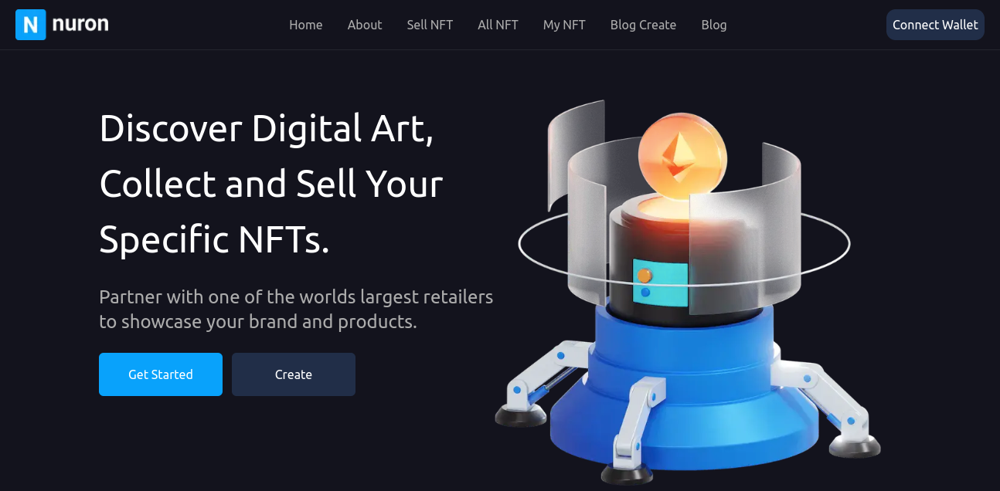
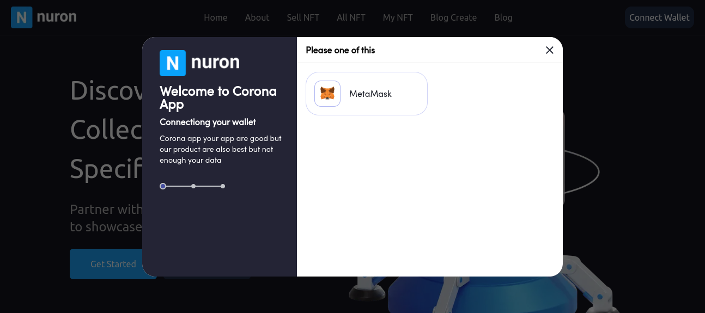
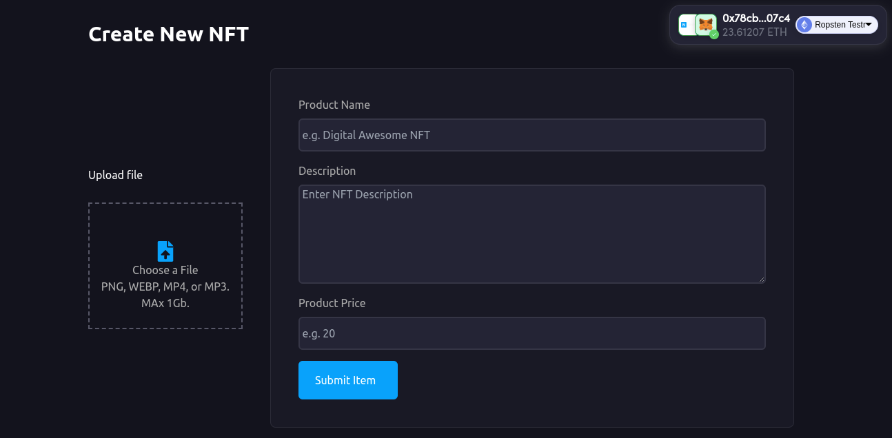
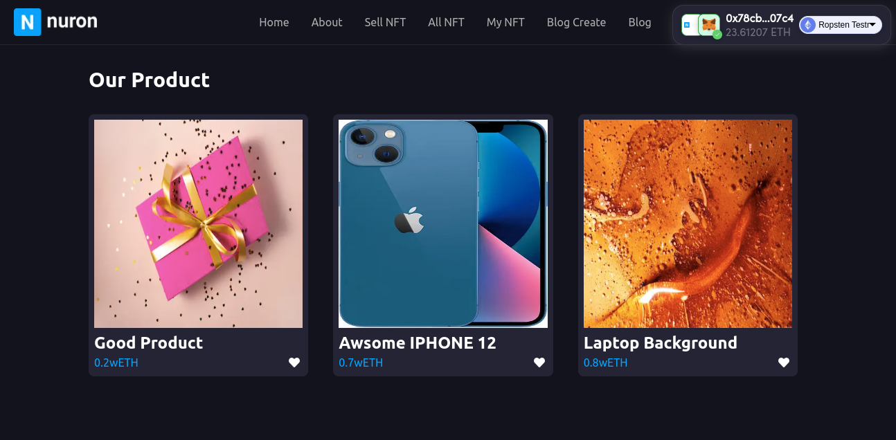
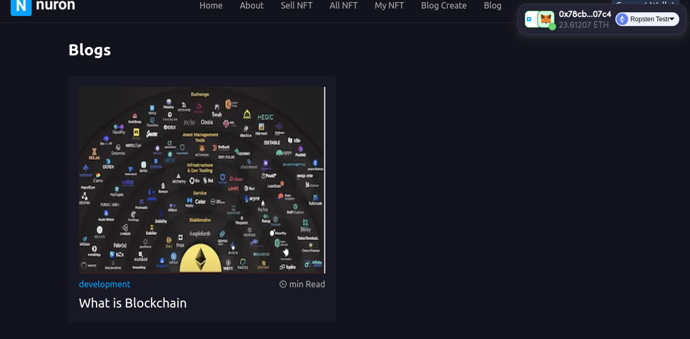

<!-- ABOUT THE PROJECT -->
# Nuron NFT MarketPlace

A Nuron NFT Marketplace is NFT for sell and buy Product using Openzepplin (ERC721), Hardhat and Solidity.

Home Page

### Built With

* [Solidity](https://docs.soliditylang.org/)
* [Hardhat](https://hardhat.org/getting-started/)
* [Next.js](https://nextjs.org/)
* [ethers.js](https://docs.ethers.io/v5/)
* [web3-Onboard](https://docs.blocknative.com/onboard)
* [TailwindCss](https://tailwindcss.com/)

### User interface
   
The front end is built with Next JS it's framework of React, it allows users to mint new NFTS and they can find on the home page a complete roadmap for the entire NFT project, the app also give a simple admin dashboard for setting minting prices and managing the sales period ( whitelisting, presale, public sale).

The front-end is built using the following libraries:
      <ul>
        <li><b>Ethers.js:</b> used as interface between the UI and the deployed smart contract</li>
        <li><b>Web3-Onboard:</b> for conecting to Metamask</li>
        <li><b>mobx:</b> for managing the app states (account, balance, blockchain) </li>
        <li><b>Tailwind CSS:</b> Styles using TailwindCss</li>    
      </ul>
      
The main component is Mint.js which handles the nft minting and the coundown periods : 

Connect Wallet:

Create NFT:

All NFTs:

Blogs (All blogs are stored in Blockchain)

(<a href="#top">back to top</a>)

### Prerequisites

* [nodejs](https://nodejs.org/en/download/) and [yarn](https://classic.yarnpkg.com/en/)
* [MetaMask](https://chrome.google.com/webstore/detail/metamask/nkbihfbeogaeaoehlefnkodbefgpgknn) Chrome extension installed in your browser
* [Hardhat](https://hardhat.org/) for local smart contracts deployement and testing
* [nft.storage](https://nft.storage/) account for IPFS storage (free account).